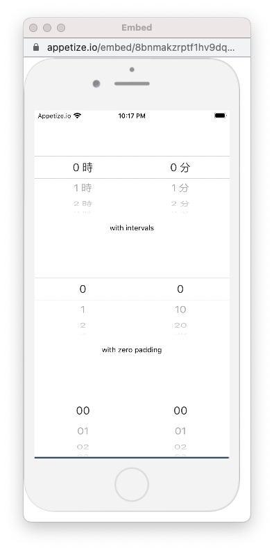
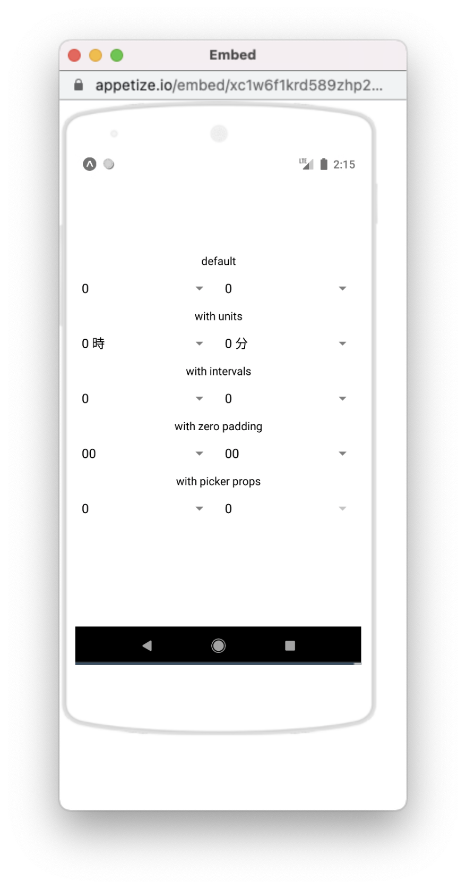

<!-- prettier-ignore -->
| iOS | Android |
| --- | --- |
|  |  |

Simple wrapper component on [@react-native-picker/picker](https://www.npmjs.com/package/@react-native-picker/picker).

## Install

```
# React Native
npm install react-native-simple-time-picker @react-native-picker/picker
npx pod-install

# Expo
expo install react-native-simple-time-picker @react-native-picker/picker
```

## Usage

```tsx
import React from 'react';
import {TimePicker, ValueMap} from 'react-native-simple-time-picker';

const YourApp = () => {
  const [value, setValue] = useState<ValueMap>({
    hours: 1,
    minutes: 0,
    seconds: 0,
  });
  const handleChange = (newValue: ValueMap) => {
    setValue(newValue);
  };
  return <TimePicker value={value} onChange={handleChange} />;
};
```

## Props

<!-- prettier-ignore -->
| Property         | Type                       | Default                | Description                                                                                  |
| ---------------- | -------------------------- | ---------------------- | -------------------------------------------------------------------------------------------- |
| value        | `{ hours: number, minutes: number, seconds: number, ampm?: 'am' \| 'pm' }`  |  `{ hours: 0, minutes: 0, seconds: 0 }` | Controlled state               |
| defaultValue | `{ hours: number, minutes: number, seconds: number, ampm?: 'am' \| 'pm' }`  |  `{ hours: 0, minutes: 0, seconds: 0 }` | Controlled state               |
| onChange         | Function                   |                        | Callback function for when values are changed `({ hours: number, minutes: number }) => void` |
| pickerShows      | Array                      | `["hours", "minutes"]` | Pickers to display (`e.g. ["hours", "minutes", "seconds"]`)                                  |
| hoursUnit        | String                     | ''                     | Hours Unit for label                                                                         |
| minutesUnit      | String                     | ''                     | Minutes Unit for label                                                                       |
| secondsUnit      | String                     | ''                     | Seconds Unit for label                                                                       |
| zeroPadding      | Boolean                    | false                  | Whether to pad numeric labels with zero                                                      |
| textColor        | String                     |                        | Color of the picker item's text                                                              |
| hoursInterval    | Integer                    | 1                      |                                                                                              |
| minutesInterval  | Integer                    | 1                      |                                                                                              |
| secondsInterval  | Integer                    | 1                      |                                                                                              |
| emptyLabel       | String                     | undefined              | Enable empty option with this label                                                          |
| isAmpm           | Boolean                    | false                  | Whether to display am/pm picker                                                              |
| ampmLocalization | { am: string, pm: string } | { am: 'am', pm: 'pm' } | Label for am/pm picker items                                                                 |

## Preview

https://snack.expo.io/@uraway/react-native-simple-time-picker

## LICENSE

MIT
